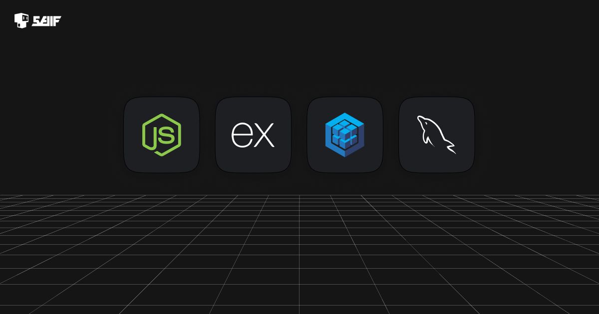
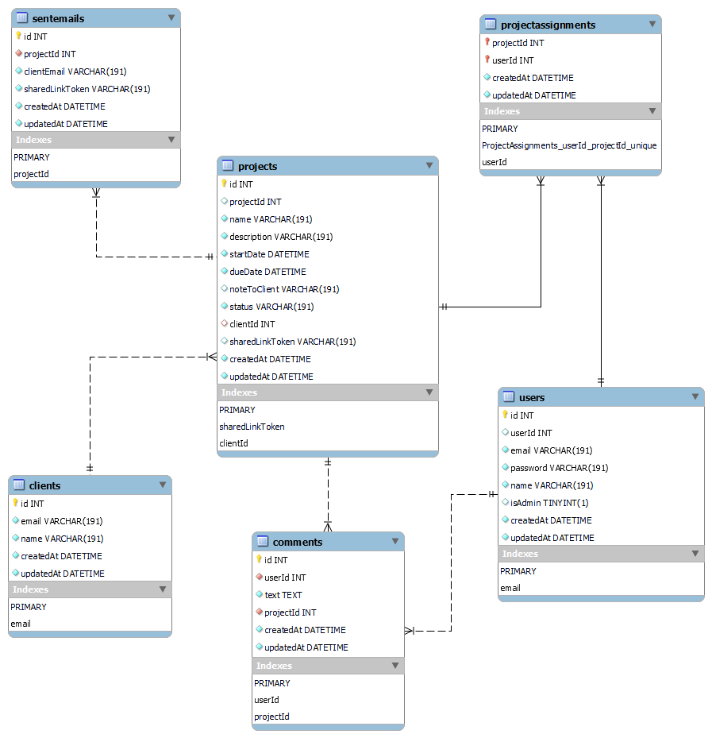

# 👷 Project Management System API v.1.0



Designed and implemented to manage projects, technicians, and clients.

## 📖 Table of Contents

- [Project Overview](#project-overview)
- [Prerequisites](#prerequisites)
- [Getting Started](#getting-started)
- [Database Schema](#database-schema)
- [API Documentation](#api-documentation)
- [Postman Collection](#postman-collection)
- [Server Deployment](#server-deployment)
- [Running Tests](#running-tests)
- [Technologies Used](#technologies-used)

## Project Overview

This Project Management System API provides functionality for managing projects, technicians, and clients. It enables admins to perform actions such as creating, updating, and deleting projects, assigning technicians, managing technicians, and interacting with clients. Technicians can view and update assigned projects, while clients receive shared links to view specific project details.

## Prerequisites

- ✅ [Node.js](https://nodejs.org/) installed
- ✅ [npm](https://www.npmjs.com/) (Node Package Manager) installed
- ✅ [Yarn](https://yarnpkg.com/) installed
- ✅ [MySQL 8.0](https://www.mysql.com/) database server installed
- ✅ [Sequelize CLI](https://github.com/sequelize/cli) version 6.35.2 installed globally: `npm install -g sequelize-cli`

## Getting Started

1. **Clone the repository:**

   ```bash
   git clone https://github.com/your-username/your-repo.git
   ```

2. **Navigate to the project folder:**

   ```bash
   cd your-repo
   ```

3. **Install dependencies using Yarn or npm:**

   ```bash
   yarn install
   ```

   or using npm:

   ```bash
   npm install
   ```

4. **Create a `.env` file in the root of the project and add the following configurations:**

   ```env
   NODE_ENV=development
   JWT_SECRET=98tBdNTt6RCPjeLQbQgVwjLgDMUlunA3
   SESSION_SECRET=1d3x0EV8rKgNgoknOf6KHQyeOGmeD20N
   MAIL_PASS=YmO&R~Ct&gB9;x<Qnq;5M7
   ```

   Adjust this value as needed:

   - To **force synchronization** in development: `NODE_ENV=development`
   - To disable force synchronization: `NODE_ENV=production`

---

5. **Run database migrations:**

   ```bash
   sequelize db:migrate
   ```

6. **Seed the database with an admin user:**

   ```bash
   sequelize db:seed --seed create-admin-user.js
   ```

   This command initializes your database with an admin user.

   👉 To authenticate and obtain a Bearer token, use the following credentials with a `POST` request to `/api/v1/auth/login`:

   ```json
   {
     "email": "admin@gmail.com",
     "password": "123456"
   }
   ```

   Make sure to include these details in the body of your request.

   ⚠️ **Make sure to change the password immediately after logging in for security reasons.** (Password changing to be implemented in the future.)

7. **Start the application:**

   ```bash
   yarn start
   ```

   or using npm:

   ```bash
   npm start
   ```

8. **Access the application at [http://localhost:3000](http://localhost:3000).**

## Database Schema



## API Documentation

[Link to Swagger API Documentation](#)

## Postman Collection

[Link to Postman Collection](#)

## Server Deployment

[Link to Server Deployment (e.g., Heroku)](#)

## Running Tests

To run tests, use the following command:

```bash
yarn test
```

## Technologies Used

- **Node.js**: JavaScript runtime for server-side development.
- **Express.js**: Web application framework for Node.js.
- **Sequelize ORM**: Promise-based Node.js ORM for PostgreSQL, MySQL, SQLite, and MSSQL.
- **MySQL**: Relational database management system.
- **bcrypt**: Password hashing library for securing user passwords.
- **compression**: Middleware for compressing HTTP responses.
- **passport**: Authentication middleware for Node.js.
- **passport-jwt**: Passport strategy for authenticating with a JSON Web Token (JWT).
- **node-cron**: Cron-like scheduler for scheduling tasks in Node.js.
- **nodemon**: Utility for auto-restarting the server during development.
- **Jest**: JavaScript testing framework.
- **supertest**: HTTP testing library for Node.js.

### ✍️ Why Sequelize ORM?

Sequelize ORM was chosen for its robust features and advantages:

- **Model-Driven Development**: Sequelize follows a model-driven approach, allowing developers to define models for data structures and relationships, leading to cleaner and more maintainable code.

- **Cross-Database Compatibility**: With Sequelize, you can easily switch between different relational databases without changing much of the code. This flexibility is particularly useful for projects that might need to migrate or support multiple database systems.

- **Promises and Async/Await**: Sequelize uses promises and supports async/await, making it easy to handle asynchronous operations and ensuring a more readable and maintainable codebase.

- **Middleware Support**: Sequelize supports middleware hooks, enabling developers to execute custom logic before or after certain actions, providing greater control over the database operations.

👉 By leveraging Sequelize, this project benefits from improved code organization, database flexibility, and a more developer-friendly experience.
