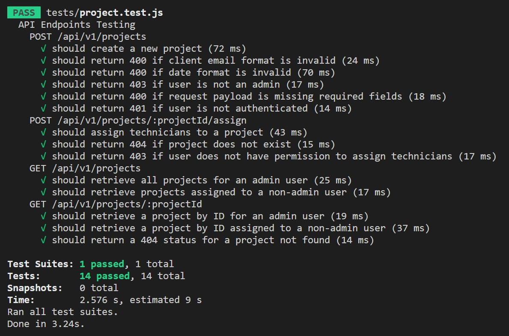

# 👷 Project Management System API v.1.0


👨‍💻 Designed and implemented to manage projects, technicians, and clients.

[](https://nodejs.org/) [](https://expressjs.com/) [](https://sequelize.org/) [](https://www.mysql.com/) [](https://jestjs.io/) [](https://www.npmjs.com/) [](https://yarnpkg.com/)

## 📖 Table of Contents

- [👷 Project Management System API v.1.0](#-project-management-system-api-v10)
  - [📖 Table of Contents](#-table-of-contents)
  - [Project Overview](#project-overview)
  - [Prerequisites](#prerequisites)
  - [Getting Started](#getting-started)
  - [Database Migration and Seeding for Production](#database-migration-and-seeding-for-production)
  - [Database Configuration](#database-configuration)
    - [🔨 Development Configuration](#-development-configuration)
    - [🧪 Test Configuration](#-test-configuration)
    - [🌐 Production Configuration](#-production-configuration)
  - [Database Schema](#database-schema)
  - [API Documentation](#api-documentation)
  - [Postman Collection](#postman-collection)
  - [Server Deployment](#server-deployment)
  - [Running Tests](#running-tests)
  - [Testing Scenarios](#testing-scenarios)
    - [Create a New Project (POST /api/v1/projects)](#create-a-new-project-post-apiv1projects)
    - [Assign Technicians to a Project (POST /api/v1/projects/:projectId/assign)](#assign-technicians-to-a-project-post-apiv1projectsprojectidassign)
    - [Retrieve All Projects (GET /api/v1/projects)](#retrieve-all-projects-get-apiv1projects)
    - [Retrieve a Project by ID (GET /api/v1/projects/:projectId)](#retrieve-a-project-by-id-get-apiv1projectsprojectid)
  - [Technologies Used](#technologies-used)
    - [Note 🙌: Why Sequelize ORM?](#note--why-sequelize-orm)

## Project Overview

This Project Management System API provides functionality for managing projects, technicians, and clients. It enables admins to perform actions such as creating, updating, and deleting projects, assigning technicians, managing technicians, and interacting with clients. Technicians can view and update assigned projects, while clients receive shared links to view specific project details.

## Prerequisites

- ✅ [Node.js](https://nodejs.org/) installed

- ✅ [npm](https://www.npmjs.com/) (Node Package Manager) installed

- ✅ [Yarn](https://yarnpkg.com/) installed

- ✅ [MySQL 8.0](https://www.mysql.com/) database server installed

- ✅ [Sequelize CLI](https://github.com/sequelize/cli) version 6.35.2 installed globally: `npm install -g sequelize-cli`

## Getting Started

1. **Clone the repository:**

```bash


git clone https://github.com/seifeldinio/pms.git


```

2. **Navigate to the project folder:**

```bash


cd pms


```

3. **Install dependencies using Yarn or npm:**

```bash


yarn


```

or using npm:

```bash


npm install


```

4. **Create a `.env` file in the root of the project and add the following configurations:**

```env


APP_PORT=3000


NODE_ENV=production


JWT_SECRET=98tBdNTt6RCPjeLQbQgVwjLgDMUlunA3


SESSION_SECRET=1d3x0EV8rKgNgoknOf6KHQyeOGmeD20N


MAIL_PASS=YmO&R~Ct&gB9;x<Qnq;5M7


```

Adjust this value as needed:

- To **force synchronization** in development or testing: `NODE_ENV=test`

- To disable force synchronization: `NODE_ENV=production`

---

5. 🐬 **Run database migrations:**

```bash


sequelize db:migrate


```

6. **Seed the database with an admin user:**

```bash


sequelize db:seed --seed create-admin-user.js


```

This command initializes your database with an admin user.

👉 To authenticate and obtain a Bearer token, use the following credentials with a `POST` request to `/api/v1/auth/login`:

```json
{
  "email": "admin@gmail.com",

  "password": "123456"
}
```

Make sure to include these details in the body of your request.

⚠️ **Make sure to change the password immediately after logging in for security reasons.** (Password changing to be implemented in the future.)

7. 🚀 **Start the application:**

```bash


yarn start


```

or using npm:

```bash


npm start


```

8. **Access the application at [http://localhost:3000](http://localhost:3000).**

## Database Migration and Seeding for Production

To perform database migration and seeding using the production Sequelize configuration, follow these commands:

```bash

npx sequelize-cli db:migrate --env production

```

```bash

sequelize db:seed --seed create-admin-user.js --env production

```

🚀 To start the application in production mode, execute:

```bash

yarn start --production

```

---

## Database Configuration

The database configuration for the Project Management System API is defined in the `config/config.json` file. This file contains separate configurations for development, test, and production environments. You can customize the database connection settings based on your requirements.

### 🔨 Development Configuration

For development purposes, the configuration includes:

- **Username:** root

- **Password:** admin1234

- **Database Name:** pms_db

- **Host:** localhost

- **Port:** 3308

- **Dialect:** mysql

- **Logging:** Enabled

- **Character Set:** utf8mb4

### 🧪 Test Configuration

The test environment uses the same configuration as development, with the only difference being that logging is turned off to reduce noise during testing.

### 🌐 Production Configuration

In a production environment, the configuration is optimized for security and performance. It includes:

- **Username:** [Your Production Username]

- **Password:** [Your Production Password]

- **Database Name:** [Your Production Database Name]

- **Host:** [Your Host]

- **Port:** 3306

- **Dialect:** mysql

- **Logging:** Disabled

- **Character Set:** utf8mb4

- **SSL:** Enabled with additional options for secure communication

Please ensure to modify the production configuration with the appropriate credentials and settings for your deployment.

⚠️ **Note:** It is crucial to handle production credentials securely and follow best practices for database connection security.

## Database Schema


---

## API Documentation

[Link to Swagger API Documentation](https://pms-wkupx.ondigitalocean.app/api-docs/)

## Postman Collection

[Link to Postman Collection](https://www.postman.com/seiifroboot/workspace/apis/collection/15911527-924df702-f582-40f2-9d49-570bd429bbfd?action=share&creator=15911527)

## Server Deployment

[Link to Server Deployment](https://pms-wkupx.ondigitalocean.app/)

## Running Tests

Before running tests, make sure to set the `NODE_ENV` environment variable to `test` in the `.env` file. This ensures that the tests use the test environment configuration.

```bash


NODE_ENV=test


```

After setting the environment variable, start the application using:

```bash


yarn start


```

Ensure that the application is running correctly. Once the application is running, open a new terminal window and execute the following command to run the tests:

```bash


yarn test


```

This command will execute the tests and provide feedback on their success or failure. The testing environment is isolated, and breaking changes won't affect the production environment.

## Testing Scenarios

The API endpoints have been thoroughly tested to ensure proper functionality and handle various scenarios.
👇 Below are the scenarios covered in the testing process:

### Create a New Project (POST /api/v1/projects)

- Should create a new project
- Should return 400 if the client email format is invalid
- Should return 400 if the date format is invalid
- Should return 403 if the user is not an admin
- Should return 400 if the request payload is missing required fields
- Should return 401 if the user is not authenticated

### Assign Technicians to a Project (POST /api/v1/projects/:projectId/assign)

- Should assign technicians to a project
- Should return 404 if the project does not exist
- Should return 403 if the user does not have permission to assign technicians

### Retrieve All Projects (GET /api/v1/projects)

- Should retrieve all projects for an admin user
- Should retrieve projects assigned to a non-admin user

### Retrieve a Project by ID (GET /api/v1/projects/:projectId)

- Should retrieve a project by ID for an admin user
- Should retrieve a project by ID assigned to a non-admin user
- Should return a 404 status for a project not found

🧪 The testing process covered these scenarios to ensure robustness and reliability of the Project Management System API.



---

## Technologies Used

- ✨ **Node.js**: JavaScript runtime for server-side development.

- ✨ **Express.js**: Web application framework for Node.js.

- ✨ **Sequelize ORM**: Promise-based Node.js ORM for PostgreSQL, MySQL, SQLite, and MSSQL.

- ✨ **MySQL**: Relational database management system.

- **bcrypt**: Password hashing library for securing user passwords.

- **compression**: Middleware for compressing HTTP responses.

- **passport**: Authentication middleware for Node.js.

- **passport-jwt**: Passport strategy for authenticating with a JSON Web Token (JWT).

- **node-cron**: Cron-like scheduler for scheduling tasks in Node.js.

- **nodemon**: Utility for auto-restarting the server during development.

- **Jest**: JavaScript testing framework.

- **supertest**: HTTP testing library for Node.js.

---

### Note 🙌: Why Sequelize ORM?

Sequelize ORM was chosen for its robust features and advantages:

- 👉 **Model-Driven Development**: Sequelize follows a model-driven approach, allowing developers to define models for data structures and relationships, leading to cleaner and more maintainable code.

- 👉 **Cross-Database Compatibility**: With Sequelize, you can easily switch between different relational databases without changing much of the code. This flexibility is particularly useful for projects that might need to migrate or support multiple database systems.
- 👉 **Promises and Async/Await**: Sequelize uses promises and supports async/await, making it easy to handle asynchronous operations and ensuring a more readable and maintainable codebase.

- 👉 **Middleware Support**: Sequelize supports middleware hooks, enabling developers to execute custom logic before or after certain actions, providing greater control over the database operations.

👨‍💻 By leveraging Sequelize, this project benefits from improved code organization, database flexibility, and a more developer-friendly experience.
